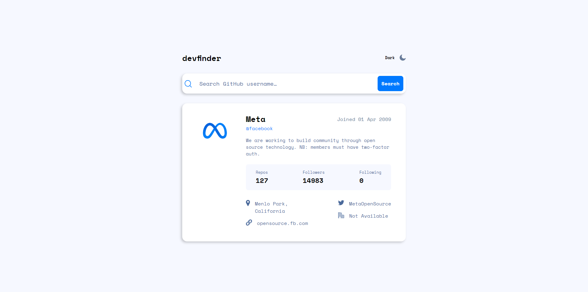
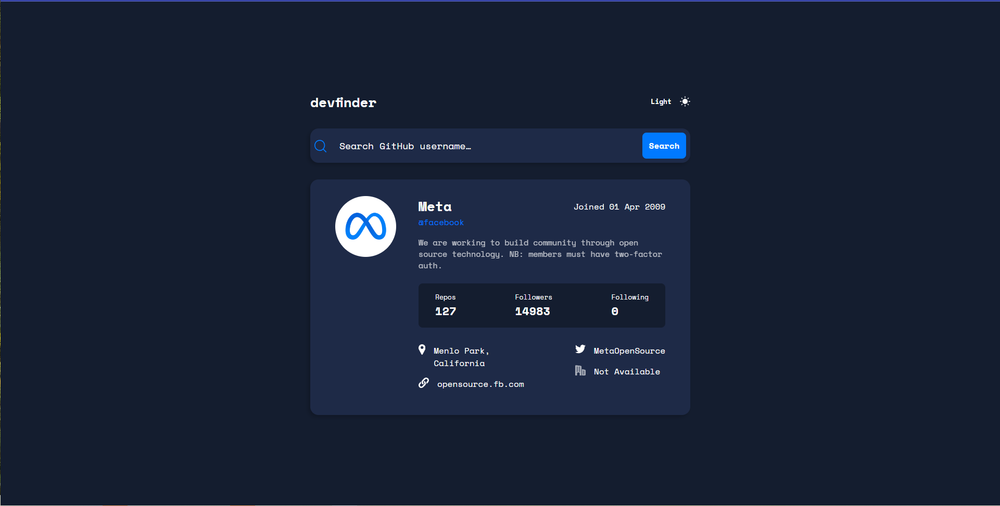
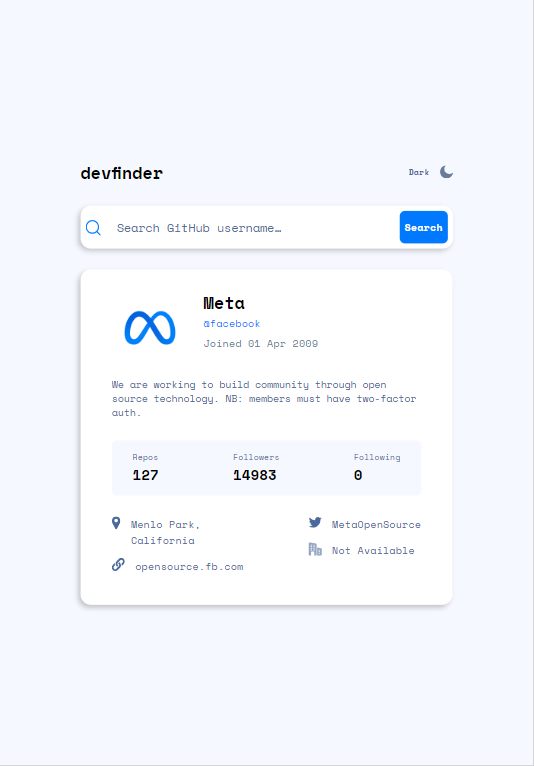
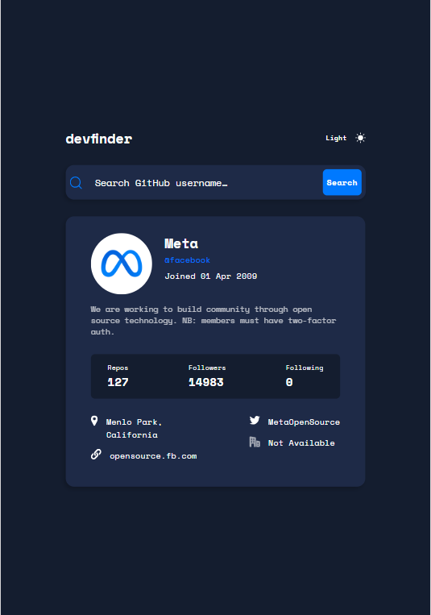
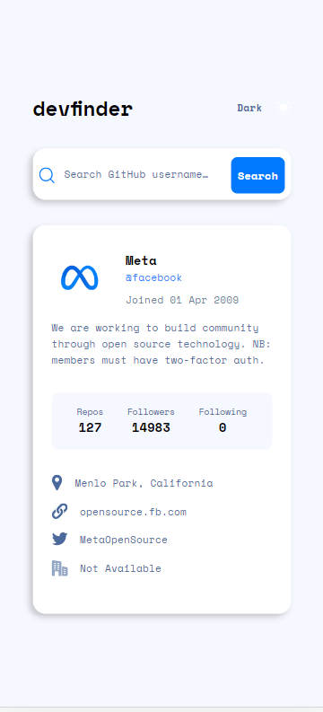
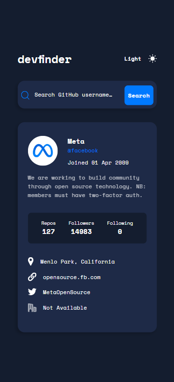

# Frontend Mentor - GitHub user search app solution

This is a solution to the [GitHub user search app challenge on Frontend Mentor](https://www.frontendmentor.io/challenges/github-user-search-app-Q09YOgaH6). Frontend Mentor challenges help you improve your coding skills by building realistic projects. 

## Table of contents

- [Overview](#overview)
  - [The challenge](#the-challenge)
  - [Screenshot](#screenshot)
  - [Links](#links)
- [My process](#my-process)
  - [Built with](#built-with)
  - [What I learned](#what-i-learned)
- [Author](#author)

## Overview
- A responsive Web Application to search for any account on Github by providing the username. It also user to toggle between Dark and Light themes.

### The challenge

Users should be able to:

- View the optimal layout for the app depending on their device's screen size
- See hover states for all interactive elements on the page
- Search for GitHub users by their username
- See relevant user information based on their search
- Switch between light and dark themes

### Screenshot
Desktop:

Tablet:

Phone:

### Links

- Solution URL: [Add solution URL here](https://github.com/OmarIsmail7980/github-user-search)
- Live Site URL: [Add live site URL here](https://your-live-site-url.com)

## My process

### Built with

- Semantic HTML5 markup
- CSS custom properties
- Flexbox
- Mobile-first workflow
- [React](https://reactjs.org/) - JS library

### What I learned

In this project I learned how enable the theme to change through out the entire app with a click.

## Author

- Website - [Omar Ismail](https://omarismail7980.github.io/Portfolio/)
- Frontend Mentor - [@OmarIsmail7980](https://www.frontendmentor.io/profile/OmarIsmail7980)

